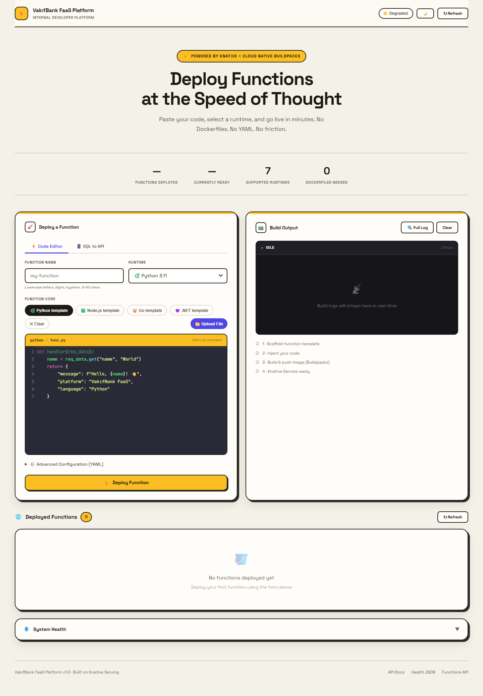
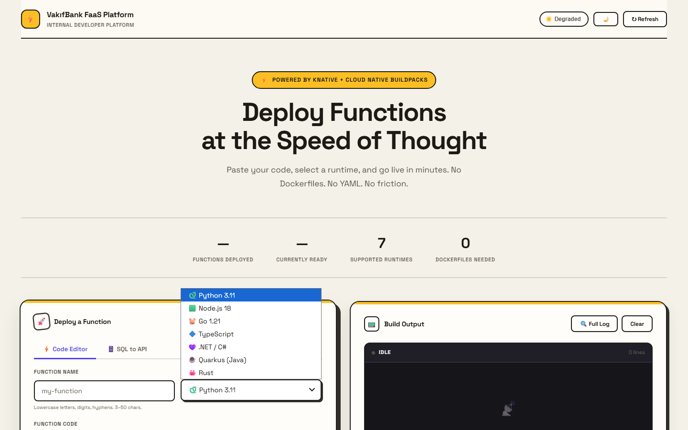
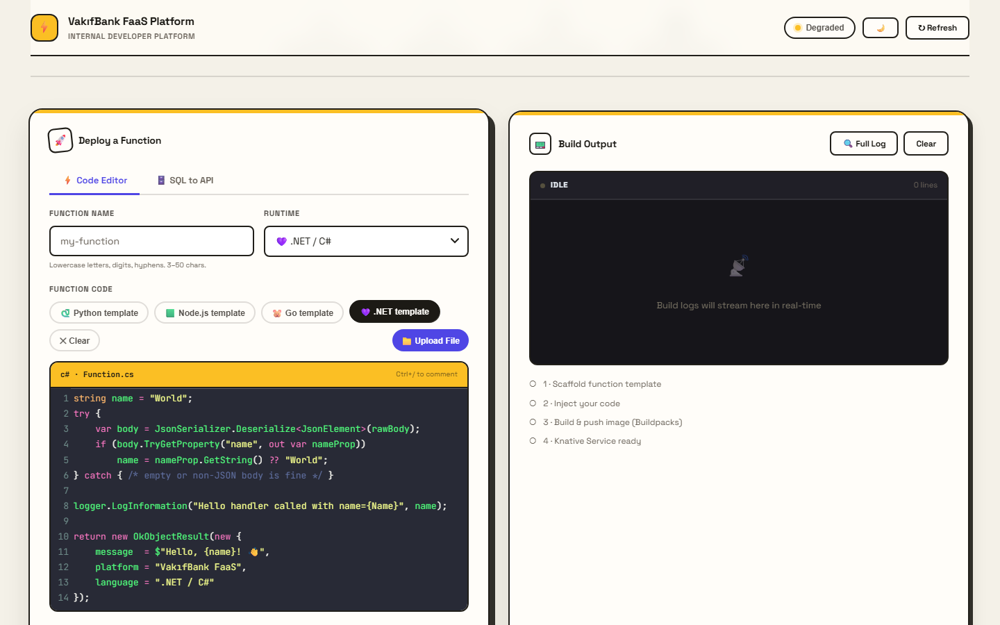
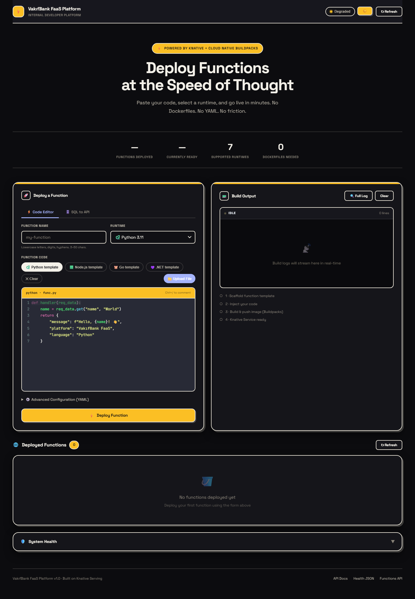

# ⚡ VakıfBank FaaS Platform

**Internal Developer Platform** for deploying serverless functions on **Kubernetes** + **Knative Serving**. Paste a code snippet, pick a language, and get a live HTTPS URL — no Dockerfiles, no YAML, no friction.

📖 Looking for architecture, self-hosting instructions, or the API reference? See **[TECHNICAL.md](TECHNICAL.md)**.

---

## What it does

- **Paste code, hit Deploy.** Pick from 7 language runtimes, write the function body, and the platform scaffolds a project, builds a container, and deploys it as a Knative Service — streamed live to the browser over SSE.
- **Scale-to-zero by default.** Idle functions cost nothing; Knative spins them back up on the first request.
- **SQL-to-API.** Point it at a Postgres/MySQL table and get a REST endpoint generated automatically — no code required.
- **Revision history built in.** Every deploy is saved as an annotated Knative Revision, so past code can be viewed and rolled back to with one click.
- **Production-hardened.** Per-tenant resource quotas, a Redis-backed shared state (so the orchestrator runs multiple replicas), and real HTTPS via cert-manager + Let's Encrypt — see [TECHNICAL.md](TECHNICAL.md#production-hardening) for how each works.

---

## How it works

Six languages go through `func`'s own Buildpacks — it turns source code into a container without anyone writing a Dockerfile. `func` has no built-in .NET template, so for that one language the platform builds the image itself from a small pre-written Dockerfile (`backend/scaffolds/dotnet/`) and only hands `func` an already-built image to register as a Knative Service. Either way, the person deploying a function never sees a Dockerfile.

---

## Screenshots

<table>
<tr>
<td width="50%"></td>
<td width="50%"></td>
</tr>
<tr>
<td align="center">7 runtimes, one dropdown</td>
<td align="center">.NET / C# template, syntax-highlighted</td>
</tr>
</table>

<b>Dark mode</b>

 

---

## Supported Languages

| Language | Runtime key | Entrypoint file | Build path |
|----------|-------------|------------------|------------|
| Python 3.11 | `python` | `function/func.py` | Buildpacks |
| Node.js 18 | `node` | `index.js` | Buildpacks |
| Go 1.21 | `go` | `function.go` | Buildpacks |
| TypeScript | `typescript` | `index.ts` | Buildpacks |
| **.NET 8 / C#** | `dotnet` | `Function.cs` | Dockerfile¹ |
| Quarkus (Java) | `quarkus` | `src/main/java/functions/Function.java` | Buildpacks |
| Rust | `rust` | `src/main.rs` | Buildpacks |

¹ `func` ships no .NET template, and even its Dockerfile-aware "host" builder rejects runtimes it doesn't recognize. The platform works around this by scaffolding a static Dockerfile/`.csproj` itself, building and pushing the image with plain `docker build`/`docker push`, then calling `func deploy --build=false --image ...` purely to register the already-built image as a Knative Service. See `backend/services/pipeline.py`.

---

## Access Points (Production)

- 🔐 **FaaS UI (TLS)**: https://134.122.61.206.sslip.io
- 🌐 **FaaS UI (legacy)**: [http://134.122.61.206:30081](http://134.122.61.206:30081)
- 📚 **API Docs (Swagger)**: [http://134.122.61.206:30081/docs](http://134.122.61.206:30081/docs)

Want to run your own copy? [TECHNICAL.md](TECHNICAL.md#fork--self-host-this-project) has the full fork-and-deploy checklist.
