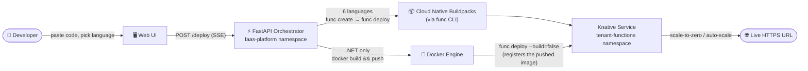

# ⚡ VakıfBank FaaS Platform

**Internal Developer Platform** for deploying serverless functions on **Kubernetes** + **Knative Serving**. Paste a code snippet, pick a language, and get a live HTTPS URL — no Dockerfiles, no YAML, no friction.


[](https://github.com/SweizNN/Vakifbank-FaaS-Project/actions/workflows/deploy.yml)


---

## What it does

- **Paste code, hit Deploy.** Pick from 7 language runtimes, write the function body, and the platform scaffolds a project, builds a container, and deploys it as a Knative Service — streamed live to the browser over SSE.
- **Scale-to-zero by default.** Idle functions cost nothing; Knative spins them back up on the first request.
- **SQL-to-API.** Point it at a Postgres/MySQL table and get a REST endpoint generated automatically — no code required.
- **Revision history built in.** Every deploy is saved as an annotated Knative Revision, so past code can be viewed and rolled back to with one click.

---

## How it works



Six languages go through `func`'s own Buildpacks — it turns source code into a container without anyone writing a Dockerfile. `func` has no built-in .NET template, so for that one language the platform builds the image itself from a small pre-written Dockerfile (`backend/scaffolds/dotnet/`) and only hands `func` an already-built image to register as a Knative Service. Either way, the person deploying a function never sees a Dockerfile.

---

## Screenshots

<table>
<tr>
<td width="50%"></td>
<td width="50%"></td>
</tr>
<tr>
<td align="center"><sub>7 runtimes, one dropdown</sub></td>
<td align="center"><sub>.NET / C# template, syntax-highlighted</sub></td>
</tr>
</table>

<details>
<summary><b>Dark mode</b></summary>
<br/>


</details>

---

## Supported Languages

| Language | Runtime key | Entrypoint file | Build path |
|----------|-------------|------------------|------------|
| Python 3.11 | `python` | `function/func.py` | Buildpacks |
| Node.js 18 | `node` | `index.js` | Buildpacks |
| Go 1.21 | `go` | `function.go` | Buildpacks |
| TypeScript | `typescript` | `index.ts` | Buildpacks |
| **.NET 8 / C#** | `dotnet` | `Function.cs` | Dockerfile¹ |
| Quarkus (Java) | `quarkus` | `src/main/java/functions/Function.java` | Buildpacks |
| Rust | `rust` | `src/main.rs` | Buildpacks |

¹ `func` ships no .NET template, and even its Dockerfile-aware "host" builder rejects runtimes it doesn't recognize. The platform works around this by scaffolding a static Dockerfile/`.csproj` itself, building and pushing the image with plain `docker build`/`docker push`, then calling `func deploy --build=false --image ...` purely to register the already-built image as a Knative Service. See `backend/services/pipeline.py`.

---

## Project Structure

```
Vakifbank-FaaS-Project/
├── .github/workflows/deploy.yml    # CI/CD: test → build → deploy
│
├── backend/
│   ├── main.py                     # FastAPI app wiring (routers, CORS, lifespan)
│   ├── config.py                   # Env vars + LANGUAGE_CONFIG (all 7 runtimes)
│   ├── models.py                   # Pydantic request/response schemas
│   ├── routers/                    # One file per route group
│   │   ├── deploy.py               #   POST /deploy      (code editor)
│   │   ├── sql_deploy.py           #   POST /sql/deploy  (SQL-to-API)
│   │   ├── functions.py            #   list / get / rollback / delete
│   │   └── health.py, jobs.py, languages.py, logs.py, proxy.py
│   ├── services/                   # Business logic — no FastAPI imports
│   │   ├── pipeline.py             #   func create/deploy + Docker build orchestration
│   │   ├── dependencies.py         #   injects deps into each language's manifest file
│   │   ├── k8s.py                  #   kubectl wrapper functions
│   │   └── sql_pipeline.py, sql_validator.py, secret_provisioning.py, sse.py, health_check.py
│   ├── generators/sql_to_python.py # Generates func.py from a SQL table schema
│   ├── scaffolds/dotnet/           # Static Dockerfile-build scaffold (see Supported Languages)
│   ├── tests/                      # pytest suite
│   └── Dockerfile                  # Multi-stage: Python + kubectl + func CLI + docker CLI
│
├── frontend/
│   ├── index.html                  # Single-page UI shell
│   ├── style.css
│   └── js/                         # config, templates, editor, deploy, functions,
│                                    # sql-deploy, health, theme, library-modal, utils
│
├── k8s/
│   ├── namespace.yaml              # faas-platform + tenant-functions + RBAC
│   ├── deployment.yaml             # Deployment, ConfigMap, Secret, Service
│   └── kustomization.yaml
│
├── docs/screenshots/                # Images used in this README
└── README.md
```

---

## Tech Stack

| Layer | Technology |
|-------|------------|
| Infrastructure | Kubernetes, Knative Serving, Docker |
| Function Builds | Knative `func` CLI + Cloud Native Buildpacks (6 languages) · plain `docker build` for .NET |
| Backend | Python 3.11, FastAPI, uvicorn |
| Frontend | HTML5, Vanilla JS, CodeMirror editor |
| Container Registry | Docker Hub |
| CI/CD | GitHub Actions |
| Server | DigitalOcean Droplet (4 vCPU, 8 GB RAM) |

---

## Production Deployment (CI/CD)

### One-Click Deployment Methods

This platform follows a GitOps approach — there's no need to manually clone the repo or install dependencies one by one.

**1. Fresh server install.** On a brand-new, empty Ubuntu server (e.g. a DigitalOcean Droplet), this single command installs Kubernetes, Knative, and the FaaS platform end to end:

```bash
curl -sL https://raw.githubusercontent.com/sweiznn/Vakifbank-FaaS-Project/main/setup_server.sh | bash
```

**2. Manual update.** If the server is already running and you just want to pull the latest manifests from GitHub without triggering CI/CD:

```bash
kubectl apply -k https://github.com/sweiznn/Vakifbank-FaaS-Project/k8s
```

### Deploy via GitHub Actions

Pushing to `main` runs the pipeline automatically:

```bash
git add .
git commit -m "deploy: initial faas platform"
git push origin main
```

The pipeline:
1. **Test** — lint, syntax, unit, and integration tests for the Python backend
2. **Build** — builds `sweizn/faas-platform-api:sha-XXXXXXX` and pushes it to Docker Hub
3. **Deploy** — SSHes into the droplet, applies the manifests, and rolls out the new image

---

## API Reference

| Method | Endpoint | Description |
|--------|----------|-------------|
| `GET` | `/` | Web UI |
| `GET` | `/health` | Liveness/readiness probe |
| `GET` | `/health/detail` | Full system + tool health check |
| `GET` | `/languages` | Supported runtimes |
| `POST` | `/deploy` | Deploy a function from code (SSE stream) |
| `POST` | `/sql/deploy` | Deploy a SQL-to-API function (SSE stream) |
| `GET` | `/functions` | List deployed functions |
| `GET` | `/functions/{name}/code` | Get a function's current code + config |
| `GET` | `/functions/{name}/revisions` | List revision history |
| `GET` | `/functions/{name}/revision/{revision_name}/code` | Get code saved in a specific revision |
| `POST` | `/functions/{name}/rollback` | Roll traffic back to a specific revision |
| `DELETE` | `/functions/{name}` | Delete a function |
| `GET` | `/logs/{name}` | Recent pod logs |
| `POST` | `/proxy` | Proxy a request to a deployed function (CORS bypass for testing) |
| `GET` | `/jobs/{job_id}` | Deploy job status |
| `GET` | `/docs` | Swagger UI |

---

## Monitoring

```bash
# Watch pods in both namespaces
kubectl get pods -n faas-platform -w
kubectl get pods -n tenant-functions -w

# List all deployed Knative functions
kubectl get ksvc -n tenant-functions

# View orchestrator logs
kubectl logs -n faas-platform -l app=faas-platform-api -f

# View a specific function's logs
kubectl logs -n tenant-functions -l serving.knative.dev/service=my-function --prefix -f
```

---

## Access Points (Production)

- 🌐 **FaaS UI**: [http://134.122.61.206:30081](http://134.122.61.206:30081)
- 📚 **API Docs (Swagger)**: [http://134.122.61.206:30081/docs](http://134.122.61.206:30081/docs)
- 🛡️ **Health JSON**: [http://134.122.61.206:30081/health](http://134.122.61.206:30081/health)
